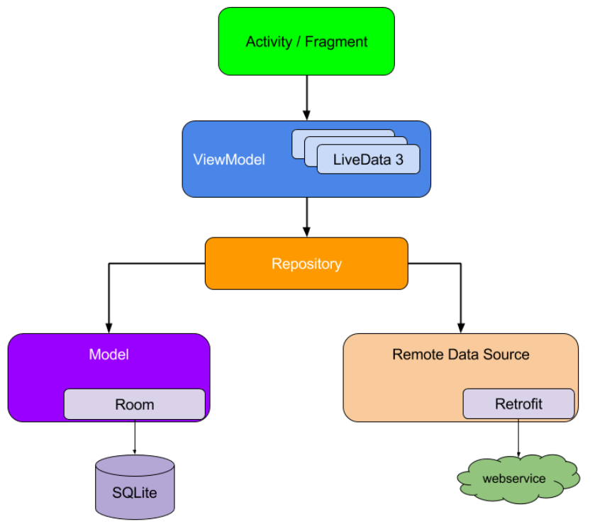
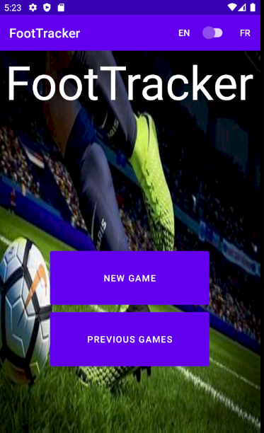
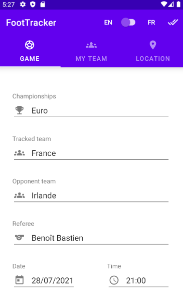
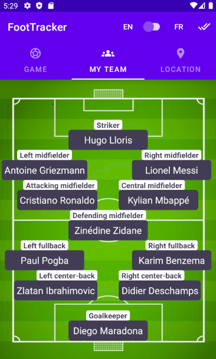
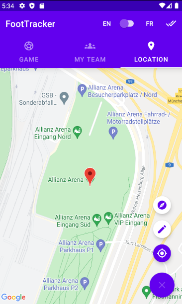
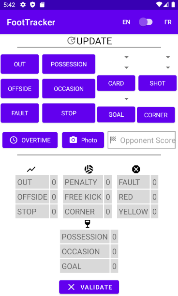
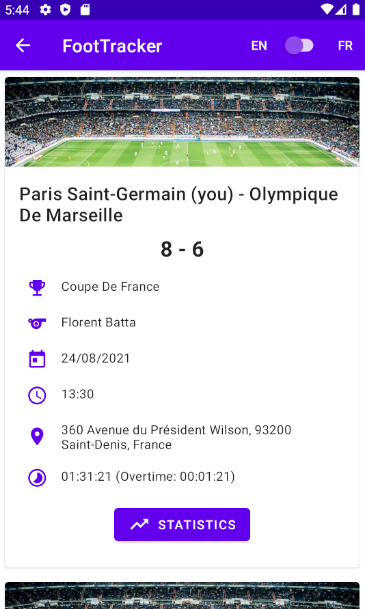
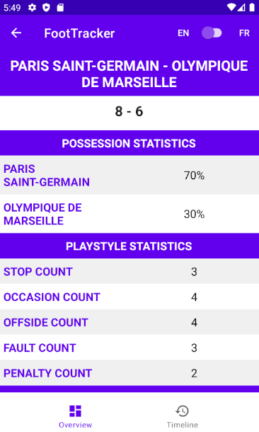
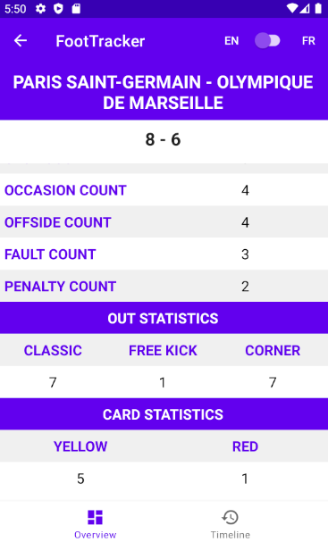
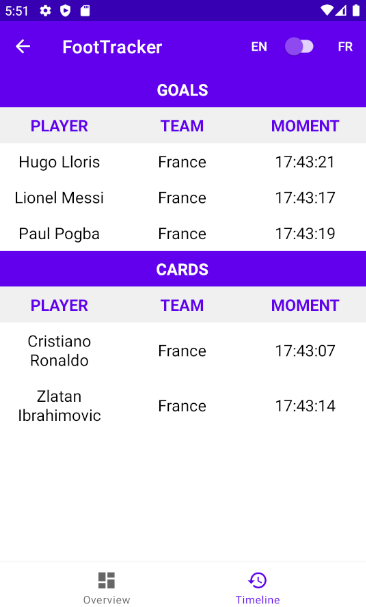

**CHOUCHANE Wiem**

**MALANDILA LEYA Brunelle**

**M1 APP LS1**

&nbsp;

# Rapport de projet de développement mobile - Foot Tracker

## Introduction

Nous avons réalisé une application qui permet à un coach d'une équipe de foot de créer des matchs confrontant une équipe suivie par ses soins à une équipe adverse. Il peut mettre à jour le déroulement de chaque match à la manière de Tennis Tracker et consulter les matchs terminés avec leurs statistiques.

&nbsp;

## Liste des fonctionnalités implémentées

&nbsp;

### Ergonomie

- Utilisation de fragments, de menus, de swipe, de layout en tabs, de pop-ups de dialogue, de bottom pager, de scroll.

- Interface adaptable : version portrait / paysage.

- Langages disponibles : français/anglais, directement via le langage choisi dans le système de l'appareil ou via une switch qui permet de modifier le langage de l'application en runtime.

&nbsp;

### Géolocalisation

*N.B : pour les 3 options suivantes, la position est effectivement affichée à l'aide d'un marqueur sur la carte après sélection puis transformée en adresse par géocodage (classe **Geocoder**).*

- Temps réel via la position courante de l'appareil.

- Possibilité d'écrire soi-même une adresse ou un lieu quelconque à la manière d'une recherche d'itinéraire Google Maps.

- Possibilité d'écrire soi-même les coordonnées GPS (latitude et longitude) d'un lieu quelconque.

Dans les 3 cas, l'implémentation a été réalisée via la classe **FusedLocationProviderClient**.

&nbsp;

### Prise de photos

- Possibilité de prendre des photos du match en utilisant les éléments suivants :

  - Un intent implicite.

  - L'objet **FileProvider** qui fourni une URI pour chaque photo prise et à stocker et permet le partage de fichiers (entre notre application et l'application caméra) de manière sécurisée.

  - Sauvegarde en local grâce à la fonction getExternalFilesDir().

### Stockage

*N.B : Pour les opérations de consultation, les données sont d'abord récupérées de la base de données locale. S'il n'y en avait pas, on les récupère depuis la BD distante (via une API externe), et on les insère en local. Pour les opérations de création / mise à jour, on stocke en local et en extérieur pour synchroniser au maximum les états des 2 stockages.*

- Sauvegarde des 5 derniers matchs dans une base de données locale SqLite : si un 6ème match doit être stocké localement, le match le plus ancien est supprimé puis le nouveau match est ajouté de sorte à ce qu'il y ait toujours au maximum 5 matchs en local. C'est l'une des 2 seules dé-synchronisations entre l'état local et distant dans l'application. Dans le cas d'une dé-synchronisation, seuls les 5 derniers matchs apparaîtront en consultation dans un 1er temps, il faudra cliquer sur un bouton "More" pour lancer la récupération des matchs restants distants qui ne figurent pas déjà dans l'interface.

- Sauvegarde de l'ensemble des match dans une base de données externe MySql comme expliqué précédemment.

- Affichage et lecture des statistiques du dernier match depuis la base de données locale et depuis la base de données externe. Il s'agit de la 2ème dé-synchronisation local/distant et elle fonctionne de la même façon que décrit plus haut.

- Lors de la création d'un match, comme il s'agit d'équipes de joueurs et que les buts marqués et cartons reçus sont nominatifs dans les statistiques, de l'auto-complétion est proposée. La BD externe a été pré-remplie avec quelques valeurs de championnats, d'arbitres, de joueurs et d'équipes. Le coach peut ainsi directement choisir une valeur déjà existante (locale ou externe) ou en taper une lui-même dans le champ d'auto-complétion, ce qui lui permet de créer lui-même un championnat, un arbitre, une équipe et sa composition (ce qui implique qu'il peut également créer de nouveaux joueurs). En résumé, les possibilités suivantes sont données :

  - Création de championnat.

  - Création d'arbitre.

  - Création/Mise à jour d'équipe : dans cette version, on ne fournit pas les joueurs de l'équipe adverse mais seulement ceux de l'équipe suivie par le coach. Si le coach choisit un jour une des équipes "adverses" comme équipe suivie, il devra en créer les joueurs et il s'agira alors d'une mise à jour de l'équipe.
  - Création de joueur.

- Lors de la mise à jour de match (remplissage de son déroulement) :

  - Création des buts et cartons et attribution aux joueurs.

  - Mise à jour des éléments qui serviront aux statistiques du match : mise à jour du match précédemment créé.

&nbsp;

## Liste des fonctions non implémentées

&nbsp;

Aucune faisant partie du cahier des charges.

&nbsp;

## Les évolutions possibles

&nbsp;

- Indiquer les joueurs de l'équipe adverse.

- Pouvoir mettre à jour une équipe déjà existante : mettre à jour la position des joueurs dans l'équipe ou en supprimer pour en mettre de nouveaux.

- Intégrer des diagrammes de data visualisation aux statistiques.

- Améliorer l'interface graphique.

- Ajouter les cartons/buts de l'équipe adverse.

- Pouvoir comparer les performances de l'équipe sur plusieurs match dans le temps.

- Refactorer les activités/fragments en déplaçant le code dans des classes "manager".

&nbsp;

## Architecture de l'application

&nbsp;

### Partie Java (package java.fr.android.foottracker)

&nbsp;

Nous avons utilisé une architecture basée sur le modèle MVC (Model View Controller). Nous nous sommes également basées sur les préconisations de la documentation Android en termes d'architecture et avons donc suivi le shema ci-dessous :

Nous n'avons cependant pas utilisé Room, comme indiqué dans les consignes du projet.

**app** : contient les classes utilisées dans le cadre de l'injection de dépendance vers les activités / fragments, parmi elles :

- *FootTrackerApplication* : représente notre application. Elle fournit le conteneur principal et lui injecte les dépendances nécessaires dans son constructeur (l'Executor pour la création de threads et le Handler pour la gestion des tâches à ajouter à la message queue une fois un thread terminé).

- *FootTrackerAppContainer* : conteneur principal. Il fournit l'Executor et le Handler qui lui ont été injectés ainsi que des conteneurs secondaires auxquels il aura au préalable injecté la dépendance à Retrofit pour les communications avec le serveur distant.

- *GameFormAppContainer* : conteneur secondaire utilisé dans l'activité et les fragments relatifs à la création de match. Il fournit le repository permettant les interactions de stockage dans le cadre de la création de match.

- *GameReviewAppContainer* : conteneur secondaire utilisé dans l'activité et les fragments relatifs aux statistiques des matchs. Il fournit le repository permettant les interactions de stockage dans le cadre de la consultation des statistiques des matchs.

- *GameUpdateAppContainer* : conteneur secondaire utilisé dans l'activité et les fragments relatifs à la mise à jour du déroulement d'un match. Il fournit le repository permettant les interactions de stockage dans le cadre de la la mise à jour du déroulement d'un match.

**controller**:

- *home*: contient l'activité de la page d'accueil de l'application.

- *gameform* : contient l'activité et les fragments du formulaire de création d'un match.

- *gamereview* : contient les activités et les fragments de la partie statistiques des matchs.

- *gameupdate* : contient l'activité et les fragments de la partie mise à jour du déroulement d'un match.

**model** :

- **database** : contient la classe *DbContract* qui fait une description de la base de données (noms des tables et de leurs colonnes) ainsi que la classe *DbHelper* qui permet la gestion de la base de données SqLite (création de la BD à partir d'un script SQL, connexion à la BD, suppression de la BD et gestion du versionnage de la BD).

- **entities** : 

    - *dao* : classes qui effectuent les opérations de consultation, création, modification et suppression des entités dans la base de données SQLite.

    - *common* : contient les classes mères dont les dao vont hériter pour éviter la redondance de certains champs et méthodes dans les classes ainsi qu'une factory pour générer des DAO sur demande.

    - *data* : objets associés/mappés aux entités présentes côtés serveur distant et côté SqLite. Ils servent à transférer l'ensemble des informations à insérer dans la base de données distante ou locale. Le dossier *common* contient les classes mères dont les objets data vont hériter pour éviter la redondance de certains champs et méthodes dans les classes.

- **repositories** : Les classes xxxRepository contiennent un xxxLocalDataSource et un xxxRemoteDataSource représentant respectivement les sources de données locale et distante. C'est elles qui font appel aux dao pour interagir avec la base de données SqLite ou MySql.

    - *common* : classes mères dont vont hériter les repositories et les classes de source de données (xxxDataSource).

    - *gameform* : classes qui effectuent les requêtes vers le serveur distant ou vers la base de données locale pour les classes "controller" du package gameform.

    - *gamereview* : classes qui effectuent les requêtes vers le serveur distant ou vers la base de données locale pour les classes "controller" du package gamereview.

    - *gameupdate* : classes qui effectuent les requêtes vers le serveur distant ou vers la base de données locale pour les classes "controller" du package gameupdate.
       
    - *view* : Ensemble des classes ViewModel qui vont stocker en mémoire les données utilisées par l'UI de notre application. Ces données sous stockées dans des MutableLiveData. De cette manière elles possèdent toutes un observer et l'interface utilisateur peut être acualisée et sauvegardée facilement.

**utils**: Boîte à outil qui comporte un ensemble de classes fournissants des méthodes utilisées par un certains nombre de composants de notre application, tel que la désérialisation avec le JSON, l'utilisation et la gestion des classes pour la Data, gestion du clavier, etc.

&nbsp;

## Implémentation - Screenshots

&nbsp;

Voici une description de l'application FootTracker en quelques images non exhaustives. Il est possible de scroller sur chacune le nécessitant.

&nbsp;

### **Page d'accueil** 

Possibilité de créer un match ou consulter les match précédents.

### **Formulaire de création de match** (Onglet "game")

L'utiliteur va entrer toutes les informations relatives au match (championnat, équipe, arbitre, date et heure du match avec une pop-up de picker pour chaque).

### **Formulaire de création de match** (Onglet "My team")

L'utilisateur peut ajouter des joueurs directement via cette interface et/ou visualiser les joueurs de son équipe.

### **Formulaire de création de match** (onglet location)

Affichage de la map, avec la possibilité de rentrer la localisation de différentes manières (floating action button dial en bas à droite). L'utilisateur va choisir le lieu du match, soit en géolocalisant son appareil, soit en entrant une adresse / un lieu, soit en entrant des coordonnées GPS (latitude et longitude). Dans les 3 cas, le géocodage permet d'obtenir une adresse finale pour le match.

### **Menu de la mise à jour du match**

Interface pour mettre à jour les perfromances de l'équipe (via des boutons, des spinners, editText) et suivre en même temps les résultats en temps réel (tableaux dans la 2e partie de l'écran)

### **Visualisation des match précédents**

l'utilisateur peut voir le dernier match et charger les plus anciens. Et faire un clic sur statistiques pour consulter les stats d'un match particulier. Possibilité de revenir à l'écran d'accueil.

### **Visualisation des statistiques d'un match**

L'utilisateur peut voir l'ensemble des performances de son équipe et consulter les matchs terminés.
L'onglet timeline permet de voir en détail les buts marqués ainsi que les cartons reçus (quel joueur, équipe et moment). Possibilité de revenir à l'écran des matchs terminés.

